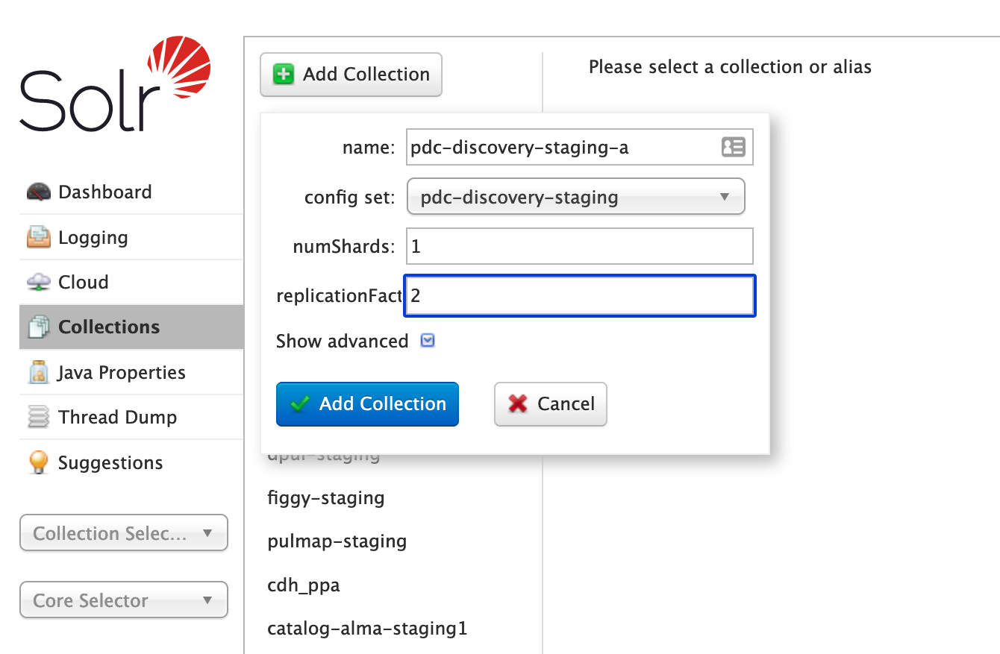
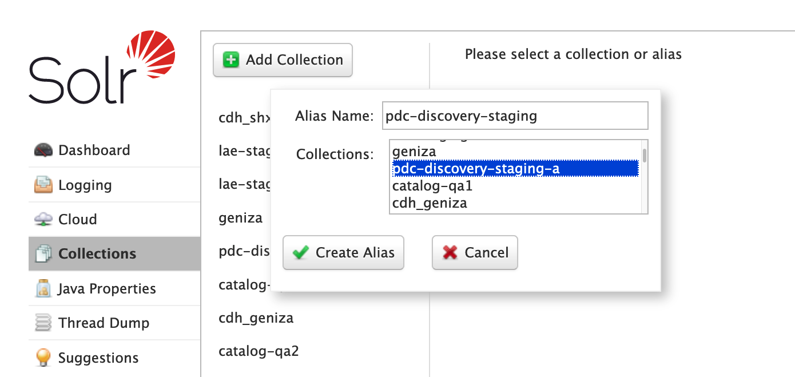

# Fix a solr mismatch
We have a Solr instance with a leader and a follower. Sometimes, they can get out of sync. When this happens, you will see very different search results from one search to the next. Here is how to resolve the issue.

1. Open a Solr console in [pul_solr](https://github.com/pulibrary/pul_solr)
1. Under Collections
   1. Look at the pdc-discovery-* alias and see which one is currently in service

   

   2. Click on Add Collection
      1. Give it a recognizeable, but different name. If the current one is `pdc-discovery-staging-a`, use `pdc-discovery-staging-b`, for example.
      2. Choose the pdc-discovery config set
      3. Choose replication factor of 2

   

   3. Delete the corrupted collection
   4. Delete the alias
   5. Recreate the alias pdc-discovery-* (staging/prod) and point it to the new collection you just created

   

 2. reindex in pdc-discovery
